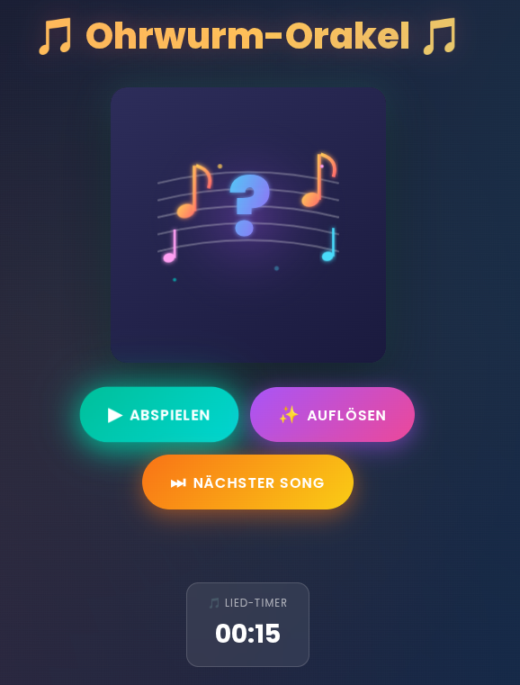
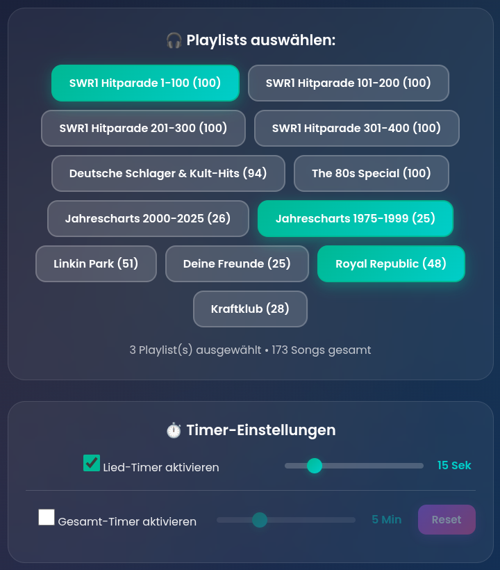

# 🎵 Ohrwurm-Orakel – Das ultimative Musik-Quiz

> 💎 Für das beste Erlebnis (ohne Werbeunterbrechungen) empfehlen wir einen Account mit **YouTube Premium**.

  
  &nbsp; &nbsp; 

**Bist du bereit, dein Musikwissen auf die Probe zu stellen?**

Mach dein Wohnzimmer zur Showbühne! Das **Ohrwurm-Orakel** ist das interaktive Musik-Quiz für echte Kenner, Party-Gamer und Nostalgiker. Egal ob du ein Kind der 80er bist, die großen Hymnen liebst oder bei aktuellen Charts mitsingen kannst – hier ist für jeden die richtige Playlist dabei.

### Das erwartet euch:

* 🚀 **Gigantische Auswahl:** Von der Hitparade über Kult-Schlager bis zu Artist-Specials.
* ⏱️ **Nervenkitzel:** Spielt gegen die Uhr! Mit den integrierten Spiel- und Lied-Timern steigt die Spannung.
* 🎉 **Party-Modus:** Perfekt für den Beamer oder das Tablet in der Tischmitte.
* 👁️ **Blind Audition:** Das Video bleibt verdeckt – verlasst euch ganz auf eure Ohren!

Einfach Playlist wählen, "Abspielen" drücken und losraten: **Interpret**, **Titel** oder **Jahr**. Wer erkennt den Song nach den ersten Sekunden?

> **Warnung:** Akute Ohrwurm-Gefahr! 🎶

---

## 🎲 Spielvarianten

Das **Ohrwurm-Orakel** ist flexibel! Egal ob ihr euch duellieren wollt, als Team gegen die Zeit spielt oder eine entspannte Runde rätselt – hier ist für jeden etwas dabei.

### 🔥 1. Der Klassiker: "Shout & Loud"
*Adrenalin pur. Jeder gegen Jeden.*

Der "Play"-Button wird gedrückt. Jetzt zählt jede Millisekunde!
* Wer zuerst **Interpret** und **Titel** korrekt in den Raum ruft, erhält den Punkt.
* 🚫 **Risiko:** Wer falsch rät, ist für den laufenden Song **gesperrt** und muss schweigen, bis die anderen gelöst haben (oder aufgeben).

### ⏳ 2. Die Zeitreise: "Timeline Battle"
*Taktik, Wissen und eine schnelle Hand.*

**Vorbereitung:** Die Jahreskärtchen liegen als Vorrat in der Tischmitte. Dazu eine **Glocke** (oder ein Buzzer). Jeder Spieler startet mit einem mittleren Jahreskärtchen vor sich.

1.  Ein Song wird angespielt.
2.  Wer glaubt, das Erscheinungsjahr zu wissen (oder wo es sich einordnet), haut auf die Glocke! 🔔
3.  **Der Einsatz:**
    * **Richtig?** Du darfst dir das entsprechende Jahreskärtchen nehmen und in deinen Zeitstrahl einbauen.
    * **Falsch?** Strafe muss sein! Du musst eines deiner bereits gewonnenen Jahreskärtchen zurück in die Mitte legen.
4.  Gewonnen hat, wer zuerst z.B. 10 Jahre gesammelt hat.

### 📝 3. Der Pub-Quiz Modus: "Blind Audition"
*Für Experten und Genießer. Kein Gebrüll, pures Wissen.*

Alle Spieler erhalten Zettel und Stift. Das Video wird in der App **verdeckt** (der "Vorhang" ist zu).
Nach jedem Song notiert jeder still seine Tipps. Erst wenn alle fertig sind, wird der Vorhang gelüftet!

**Punktevergabe (Max. 3 pro Song):**
* ✅ 1 Punkt für den richtigen **Interpreten**
* ✅ 1 Punkt für den korrekten **Songtitel**
* ✅ 1 Punkt für das exakte **Erscheinungsjahr**

### 🤝 4. Koop-Modus: "Beat the Clock"
*Ihr alle gegen die Uhr.*

Ihr spielt als ein Team. Stellt einen Timer (z.B. auf 5 oder 10 Minuten).
* Startet den ersten Song. Diskutiert kurz: *80er? 90er? Vor oder nach "Wind of Change"?*
* Wenn ihr euch einig seid, ordnet das Lied gedanklich (oder mit Karten) in euren **gemeinsamen Zeitstrahl** ein und klickt auf Auflösen.
* **Richtig?** Das Jahr wird fest eingeloggt. Nächster Song!
* **Falsch?** Der Zeitstrahl wird an dieser Stelle nicht erweitert.
* **Ziel:** Wie lang wird euer Zeitstrahl, bevor der Timer abläuft? Knackt euren Highscore!

---

## 🖨️ Material zum Ausdrucken

Damit ihr direkt loslegen könnt, habe ich Jahreskärtchen und Punktelisten vorbereitet. Einfach herunterladen, ausdrucken und ausschneiden.

* 📄 **[Jahreskärtchen (PDF) herunterladen](material/Jahreskarten.pdf)**
    *(Enthält die Jahre 1960 bis 2025)*

---

### Copyright & Lizenz
Dieses Projekt ist für die private Nutzung gedacht. Der Quellcode darf ohne meine ausdrückliche schriftliche Genehmigung nicht kopiert, modifiziert oder anderweitig verbreitet werden. Das Spielen über die bereitgestellte Webseite ist natürlich erlaubt und erwünscht!

> **Rechtlicher Hinweis:** Markennamen und Titel (z.B. *SWR1 Hitparade*) werden nur zur Identifikation der Playlists genutzt. Dieses Projekt steht in keiner Verbindung zum SWR oder anderen Rechteinhabern.
